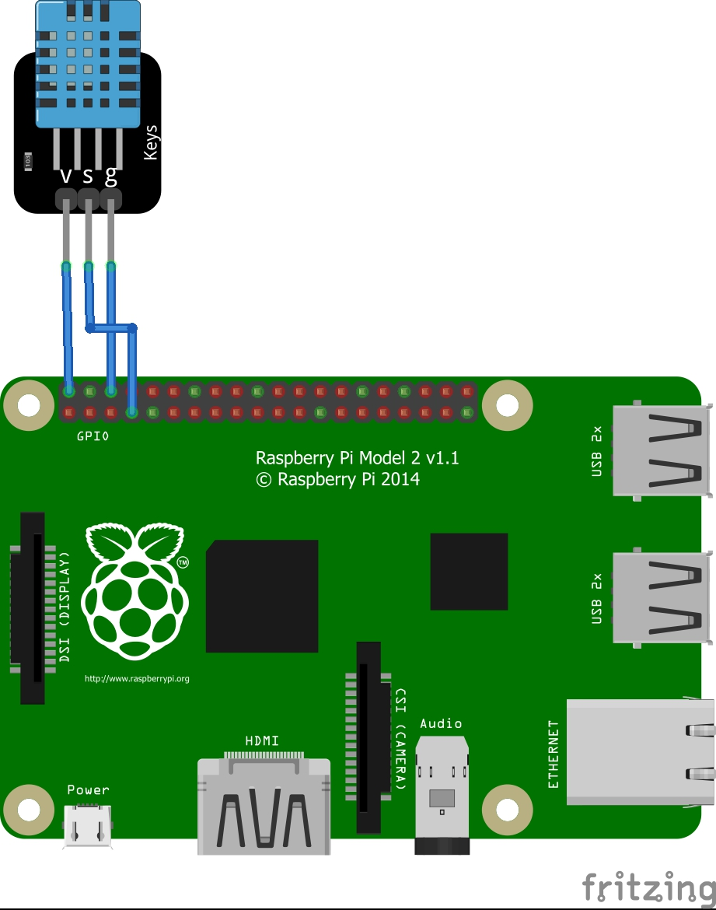

# VP1-Website-PI
DHT-11 Sensor Projekt

Wir haben einen DHT11-Sensor mit einem Raspberry Pi verbunden und eine Website erstellt, um Temperatur- und Luftfeuchtigkeitsdaten anzuzeigen. Die Website ist sowohl lokal als auch über das Internet zugänglich.

Unser Ziel war es, grundlegende Kenntnisse in Hardware, Python-Programmierung und Webentwicklung zu erlangen. Diese Dokumentation gibt einen Überblick über den Prozess und diskutiert Herausforderungen, Lösungen

Hardware-Aufbau:

Der Sensor hat einen Pin für Stromzufuhr, Signal und Erdung diese sind mit eine Plus ( + ), S und Minus ( - ) markiert. Der Plus Pin wird mit einem Female zu Female am Raspberry Pi an dem 3,3V Pin angeschlossen das ist der Pin 1, Signal empfehle ich an GPIO 4 bzw. Pin 5 anzuschließen einfach aus dem Grund, weil sie in der Nähe sind. Erdung wird an Ground angeschlossen das ist möglich an Pin 6, 9, 14, 20, 25, 30, 34 und 39 ich würde aber Pin 6 empfehlen um alles in einem Bereich anzuschließen.

Betriebssystem und Software

Betriebssystem:
Es gibt von Raspberry ein tolles Tool zum Installieren des Betriebssystems auf eine SD-Karte den Raspberry Pi Imager. Als Betriebssystem habe ich hier Raspbian OS verwendet die minimale Version ohne Desktop Oberfläche für die maximale Performance und minimalen Stromverbrauch. Ich verwende die 32 Bit Version da mehr vom Raspberry Pi 2 nicht unterstützt wird. Für diese Version wird eine SD-Karte mit mindestens 4 Gib benötigt ich empfehle aber mehr falls man den Pi nicht nur für dieses Projekt nutzen möchte. Um nun auf dem Pi arbeiten zu können öffnen sie ein Terminal fenster und geben ein ssh <benutzername>@<ip-vom-Pi>

Software:
Damit eine Webseite gehostet werden kann brauchen wir Apache2. Dies installiert man mit:
sudo apt-get update
sudo apt install apache2
Wenn sie das gemacht haben und erfolgreich installiert wurde können sie nun http://<ihre-ip-vom-pi> . Dort finden sie auch die Dokumentation von Apachen und wie sie es nutzen.
Den Speicher Ort für die Webseiten finden sie unter /var/www/html/ um dort ihre Webseiten speichern zu können müssen sie sich die Rechte dazu geben ich habe das mit:
chmod -x /var/www/hmtl/ gemacht damit wie sie später sehen können auch der Python Code schreiben und lesen darf.

Python ist standartmäßig auf dem Raspberry Pi installiert es sollte trotzdem geupdatet werden mit: 
sudo apt-get update
sudo apt-get upgrade

Wen das durchgelaufen ist, muss nun das benötigte packet installiert mit dem sie den Sensor ansprechen können:
sudo pip install adafruit_dht

Jetzt sollten sie bereit sein, um den Python und HTML code zu erstellen.

Python Code:

Dieses Python-Skript den sie unter stohatempsens.duckdns.org/temp.html  liest Temperatur- und Luftfeuchtigkeitsdaten von einem DHT-Sensor und speichert die Daten in einer HTML-Datei.

Dieses Skript verwendet die folgenden Python-Bibliotheken:
- `adafruit_dht`: Zum Auslesen der Daten vom DHT-Sensor.
- `board`: Zum Zugriff auf die GPIO-Pins des Raspberry Pi.
- `time`: Zum Hinzufügen einer Verzögerung zwischen den Sensorablesungen.

Funktionen:

`read_dht_sensor(pin)`

Diese Funktion liest die Temperatur- und Luftfeuchtigkeitsdaten vom DHT-Sensor, der an den angegebenen GPIO-Pin angeschlossen ist.

Die Funktion initialisiert den DHT-Sensor und liest dann kontinuierlich die Temperatur- und Luftfeuchtigkeitsdaten. Die Daten werden zusammen mit der aktuellen Uhrzeit in einer Liste gespeichert. Die Liste enthält immer die letzten zwei Einträge. Wenn mehr als zwei Einträge in der Liste sind, wird der älteste Eintrag entfernt.

Die Daten aus der Liste werden dann in eine HTML-Datei geschrieben, die in einem Webbrowser angezeigt werden kann. Die HTML-Datei enthält Balkendiagramme für Temperatur und Luftfeuchtigkeit.

Wenn beim Auslesen der Daten vom Sensor ein Fehler auftritt, gibt die Funktion eine Fehlermeldung aus und startet den Sensor neu.

Verwendung

Um das Skript zu verwenden, rufen Sie einfach die Python Datei auf mit: python <dateiname-vom-script>.py . Wenn das Skript erfolgreich gestartet wurde sollte nun im /HTML Ordner eine output.html Datei erstellt worden sein.
