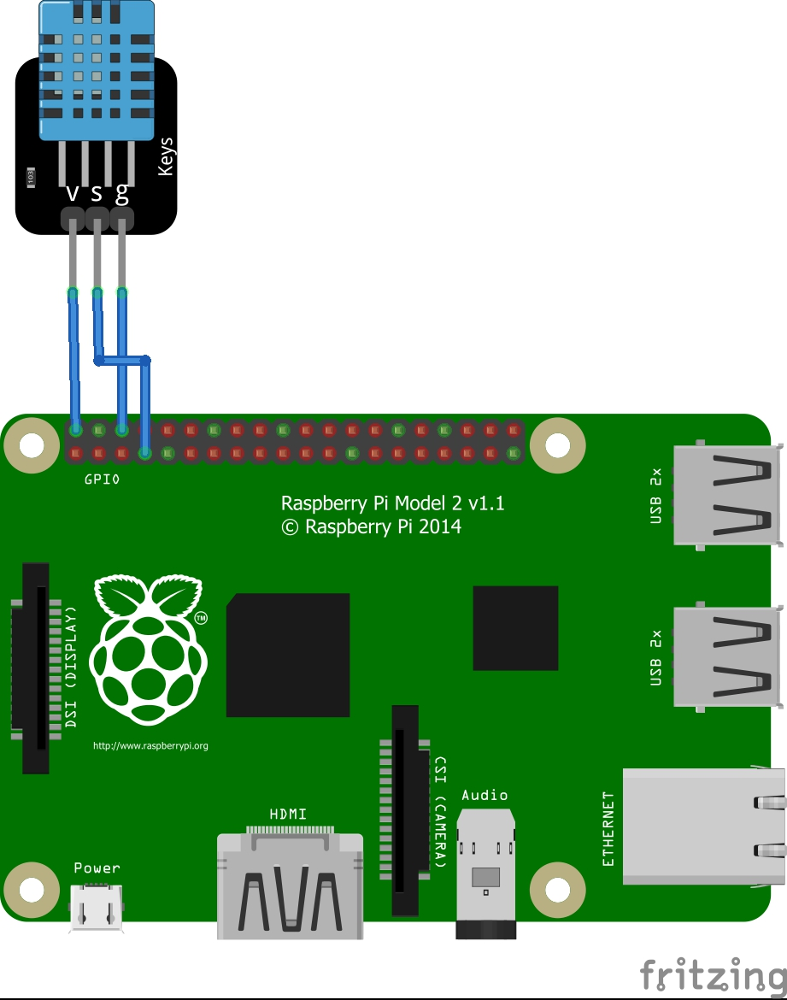

# VP1-Website-PI
DHT-11 Sensor Projekt

Wir haben einen DHT11-Sensor mit einem Raspberry Pi verbunden und eine Website erstellt, um Temperatur- und Luftfeuchtigkeitsdaten anzuzeigen. Die Website ist sowohl lokal als auch über das Internet zugänglich.

Unser Ziel war es, grundlegende Kenntnisse in Hardware, Python-Programmierung und Webentwicklung zu erlangen. Diese Dokumentation gibt einen Überblick über den Prozess und diskutiert Herausforderungen, Lösungen


## Hardware-Aufbau:

Der Sensor hat einen Pin für Stromzufuhr, Signal und Erdung diese sind mit eine Plus ( + ), S und Minus ( - ) markiert. Der Plus Pin wird mit einem Female zu Female am Raspberry Pi an dem 3,3V Pin angeschlossen das ist der Pin 1, Signal empfehle ich an GPIO 4 bzw. Pin 5 anzuschließen einfach aus dem Grund, weil sie in der Nähe sind. Erdung wird an Ground angeschlossen das ist möglich an Pin 6, 9, 14, 20, 25, 30, 34 und 39 ich würde aber Pin 6 empfehlen um alles in einem Bereich anzuschließen.





## Betriebssystem:
Es gibt von Raspberry ein tolles Tool zum Installieren des Betriebssystems auf eine SD-Karte den Raspberry Pi Imager. Als Betriebssystem habe ich hier Raspbian OS verwendet die minimale Version ohne Desktop Oberfläche für die maximale Performance und minimalen Stromverbrauch. Ich verwende die 32 Bit Version da mehr vom Raspberry Pi 2 nicht unterstützt wird. Für diese Version wird eine SD-Karte mit mindestens 4 Gib benötigt ich empfehle aber mehr falls man den Pi nicht nur für dieses Projekt nutzen möchte. Um nun auf dem Pi arbeiten zu können öffnen sie ein Terminal fenster und geben ein ssh </benutzername/>@</ip-vom-Pi/>

## Software:
Damit eine Webseite gehostet werden kann brauchen wir Apache2. Dies installiert man mit:
sudo apt-get update
sudo apt install apache2
Wenn sie das gemacht haben und erfolgreich installiert wurde können sie nun http://</ihre-ip-vom-pi/> . Dort finden sie auch die Dokumentation von Apachen und wie sie es nutzen.
Den Speicher Ort für die Webseiten finden sie unter /var/www/html/ um dort ihre Webseiten speichern zu können müssen sie sich die Rechte dazu geben ich habe das mit:
chmod -x /var/www/hmtl/ gemacht damit wie sie später sehen können auch der Python Code schreiben und lesen darf.

Python ist standartmäßig auf dem Raspberry Pi installiert es sollte trotzdem geupdatet werden mit: 
sudo apt-get update
sudo apt-get upgrade

Wen das durchgelaufen ist, muss nun das benötigte packet installiert mit dem sie den Sensor ansprechen können:
sudo pip install adafruit_dht

Jetzt sollten sie bereit sein, um den Python und HTML code zu erstellen.


## Python Code:

Dieses Python-Skript den sie unter [wohingehts.org](http://wohingehts.org/index.html)  liest Temperatur- und Luftfeuchtigkeitsdaten von einem DHT-Sensor und speichert die Daten in einer HTML-Datei.


Dieses Skript verwendet die folgenden Python-Bibliotheken:
- `adafruit_dht`: Zum Auslesen der Daten vom DHT-Sensor.
- `board`: Zum Zugriff auf die GPIO-Pins des Raspberry Pi.
- `time`: Zum Hinzufügen einer Verzögerung zwischen den Sensorablesungen.

Funktionen:

`read_dht_sensor(pin)`

Diese Funktion liest die Temperatur- und Luftfeuchtigkeitsdaten vom DHT-Sensor, der an den angegebenen GPIO-Pin angeschlossen ist.

Die Funktion initialisiert den DHT-Sensor und liest dann kontinuierlich die Temperatur- und Luftfeuchtigkeitsdaten. Die Daten werden zusammen mit der aktuellen Uhrzeit in einer Liste gespeichert. Die Liste enthält immer die letzten zwei Einträge. Wenn mehr als zwei Einträge in der Liste sind, wird der älteste Eintrag entfernt.

Die Daten aus der Liste werden dann in eine HTML-Datei geschrieben, die in einem Webbrowser angezeigt werden kann. Die HTML-Datei enthält Balkendiagramme für Temperatur und Luftfeuchtigkeit.

Wenn beim Auslesen der Daten vom Sensor ein Fehler auftritt, gibt die Funktion eine Fehlermeldung aus und startet den Sensor neu.

## Verwendung

Um das Skript zu verwenden, rufen Sie einfach die Python Datei auf mit: 
python (dateiname-vom-script).py
Wenn das Skript erfolgreich gestartet wurde, sollte nun im /html Ordner eine output.html Datei erstellt worden sein.

Wenn der Code auch weiterlaufen soll, wenn der Pi neustartet, kann man einen Service einrichten, der den Code im Hintergrund laufen lässt und bei Systemstart auch ohne Nutzer Anmeldung der Code gestartet wird. Das funktioniert nur wenn der Nutzer, den man angibt, auch die Berechtigungen hat auf die benötigten Python Pakete und Dateien hat. 

Service Datei erstellen:
sudo nano /etc/systemd/system/beispiel_temperatur.service

Ein Beispiel Service Datei:
```service
[Unit]
Description=Beispiel Service
After=network.target
[Service]
WorkingDirectory=/pfad/zur/python/datei
ExecStart=/pfad/zu/python/mit/packeten/python /pfad/zur/python/datei/beispiel-temperatur.py
Restart=always
User=NutzerMitDenPassendenRechten
StandardOutput=file:/var/log/möglicher-log.log
StandardError=file:/var/log/mögliche-error-ausgabe-error.log
[Install]
WantedBy=multi-user.target
```

Speichere die Datei und schließe den Texteditor. Danach aktualisiere den Systemd-Daemon:
```batch
sudo systemctl daemon-reload
```
Aktiviere und starte den Service:
```batch
sudo systemctl enable beispiel_temperatur.service
sudo systemctl start discord-bot
```
Den Status kann man Überprüfen:
```batch
sudo systemctl status beispiel_temperatur.service
```
HTML-Seite

 

Auf der HTML Seite kann man die aktuelle Temperatur und die Luftfeuchtigkeit ablesen
HTML-code:

 

Auf unserer Internetseite haben wir gezeigt wie wir den Python code geschrieben und erklärt haben, dazu zeigen wir wie wir den Code für die HTML Seite für den Temperatursensor geschrieben haben.

HTML Befehle:
1.	html: Dieses Tag markiert den Anfang und das Ende eines HTML-Dokuments. Alles, was zur Webseite gehört, wird zwischen den <html> und </html> Tags eingeschlossen.
2.	head: Innerhalb des <head> Tags werden Elemente eingeschlossen, die nicht direkt im Inhalt der Webseite erscheinen, wie Meta-Informationen, Links zu Stylesheets oder Scripts. Es ist der "Kopfbereich" der Webseite.
3.	body: Das <body> Tag umschließt den sichtbaren Teil der Webseite, also alles, was im Browserfenster angezeigt wird (Texte, Bilder, Videos usw.).
4.	meta: Meta-Tags liefern Meta-Daten über das HTML-Dokument, die meist von Suchmaschinen oder zum Setzen von Zeichensätzen genutzt werden. Beispiele sind Angaben wie Beschreibung der Seite, Autor des Dokuments und Kodierung.
5.	style: Innerhalb des <style> Tags werden CSS-Anweisungen definiert, die das Aussehen von Elementen auf der Webseite beeinflussen.
6.	font: Dieses Tag war früher gebräuchlich, um Schriftarten, -größe und -farbe zu spezifizieren, ist aber in modernem HTML veraltet und sollte durch CSS ersetzt werden.
7.	div: Das <div> Tag wird verwendet, um einen Bereich oder eine Sektion auf einer Webseite zu definieren. Es ist ein Block-Level-Element, das häufig zur Gruppierung von Elementen verwendet wird, um sie mit CSS zu formatieren.
8.	iframe: Ein <iframe> wird verwendet, um ein anderes HTML-Dokument innerhalb eines aktuellen Dokuments anzuzeigen. Es kann zum Einbetten von Videos, Karten oder einer anderen Webseite verwendet werden.
9.	a: Das Anker-Tag <a> wird verwendet, um Hyperlinks zu definieren. Es ermöglicht das Verlinken zu anderen Seiten oder Ressourcen und kann mit dem href-Attribut angegeben werden, wohin der Link führen soll.


